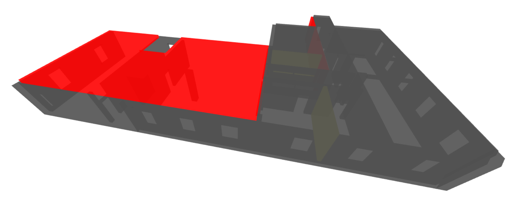

# Contilio coding challenge



## Getting Started

```sh
# clone this repository
git clone https://github.com/nickooms/contilio-coding-challenge.git
# cd into the folder
cd contilio-coding-challenge
# install packages
npm install
# run in dev mode
npm start
```
